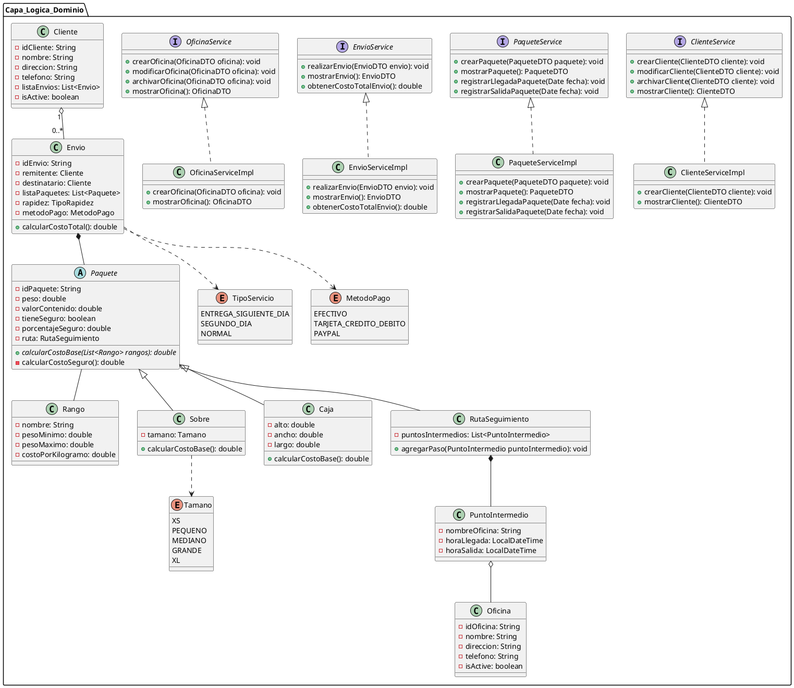

### Capa de DOMINIO

```plantuml
@startuml
namespace Capa_Logica_Dominio {
    interface ClienteService {
        + crearCliente(ClienteDTO cliente): void
+ modificarCliente(ClienteDTO cliente): void
+ archivarCliente(ClienteDTO cliente): void
        + mostrarCliente(): ClienteDTO
    }

    interface PaqueteService {
        + crearPaquete(PaqueteDTO paquete): void
        + mostrarPaquete(): PaqueteDTO
        + registrarLlegadaPaquete(Date fecha): void
        + registrarSalidaPaquete(Date fecha): void
    }

    interface EnvioService {
        + realizarEnvio(EnvioDTO envio): void
        + mostrarEnvio(): EnvioDTO
        + obtenerCostoTotalEnvio(): double
    }

interface OficinaService {
        + crearOficina(OficinaDTO oficina): void
+ modificarOficina(OficinaDTO oficina): void
+ archivarOficina(OficinaDTO oficina): void
        + mostrarOficina(): OficinaDTO
    }


class OficinaServiceImpl {
        + crearOficina(OficinaDTO oficina): void
        + mostrarOficina(): OficinaDTO
    }

class ClienteServiceImpl {
        + crearCliente(ClienteDTO cliente): void
        + mostrarCliente(): ClienteDTO
    }

    class PaqueteServiceImpl {
        + crearPaquete(PaqueteDTO paquete): void
        + mostrarPaquete(): PaqueteDTO
        + registrarLlegadaPaquete(Date fecha): void
        + registrarSalidaPaquete(Date fecha): void
    }

    class EnvioServiceImpl {
        + realizarEnvio(EnvioDTO envio): void
        + mostrarEnvio(): EnvioDTO
        + obtenerCostoTotalEnvio(): double
    }

    class Cliente {
        - idCliente: String
        - nombre: String
        - direccion: String
        - telefono: String
        - listaEnvios: List<Envio>
        - isActive: boolean
    }

    class Envio {
        - idEnvio: String
        - remitente: Cliente
        - destinatario: Cliente
        - listaPaquetes: List<Paquete>
        - rapidez: TipoRapidez
        - metodoPago: MetodoPago
        + calcularCostoTotal(): double
    }

    class Rango {
        - nombre: String
        - pesoMinimo: double
        - pesoMaximo: double
        - costoPorKilogramo: double
    }

    abstract class Paquete {
        - idPaquete: String
        - peso: double
        - valorContenido: double
        - tieneSeguro: boolean
        - porcentajeSeguro: double
        - ruta: RutaSeguimiento
        + {abstract} calcularCostoBase(List<Rango> rangos): double
        - calcularCostoSeguro(): double
    }

    class Sobre {
        - tamano: Tamano
        + calcularCostoBase(): double
    }

    class Caja {
        - alto: double
        - ancho: double
        - largo: double
        + calcularCostoBase(): double
    }

    class RutaSeguimiento {
        - puntosIntermedios: List<PuntoIntermedio>
        + agregarPaso(PuntoIntermedio puntoIntermedio): void
    }

    class Oficina {
        - idOficina: String
        - nombre: String
        - direccion: String
        - telefono: String
        - isActive: boolean
    }

    class PuntoIntermedio {
        - nombreOficina: String
        - horaLlegada: LocalDateTime
        - horaSalida: LocalDateTime
    }

    enum TipoServicio {
        ENTREGA_SIGUIENTE_DIA
        SEGUNDO_DIA
        NORMAL
    }

    enum MetodoPago {
        EFECTIVO
        TARJETA_CREDITO_DEBITO
        PAYPAL
    }

    enum Tamano {
        XS
        PEQUENO
        MEDIANO
        GRANDE
        XL
    }

    Paquete -- Rango
    Cliente "1" o-- "0..*" Envio
    Envio *-- Paquete 
    Paquete o-- RutaSeguimiento 
    Envio ..> TipoServicio
    Envio ..> MetodoPago 
    Sobre ..> Tamano
    Paquete <|-- Sobre 
    Paquete <|-- Caja 
    PuntoIntermedio o-- Oficina
    RutaSeguimiento *-- PuntoIntermedio
ClienteService <|.. ClienteServiceImpl
EnvioService <|.. EnvioServiceImpl
PaqueteService <|.. PaqueteServiceImpl
OficinaService <|.. OficinaServiceImpl
}
@enduml
```

### Capa de ACCESO A DATOS

```plantuml
@startuml
namespace Capa_Acceso_Datos {

    interface DAO<T> {
        + guardar(entidad: T): void
        + obtenerTodos(): List<T>
        + buscarPorId(id: String): Optional<T>
        + eliminar(id: String): void
    }

    abstract class DAOXML<T> {
        - rutaArchivo: String
        + guardar(entidad: T): void
        + obtenerTodos(): List<T>
        + buscarPorId(id: String): Optional<T>
        + eliminar(id: String): void
    }

    abstract class DAOBIN<T> {
        - rutaArchivo: String
        + guardar(entidad: T): void
        + obtenerTodos(): List<T>
        + buscarPorId(id: String): Optional<T>
        + eliminar(id: String): void
    }

    DAO <|.. DAOXML
    DAO <|.. DAOBIN

    class ClienteXmlDAO {
        + ClienteXmlDAO()
        + buscarPorNombre(nombre: String): List<Cliente>
        + guardar(entidad: Cliente): void
        + obtenerTodos(): List<Cliente>
        + buscarPorId(id: String): Optional<Cliente>
        + eliminar(id: String): void
    }
    class ClienteBinDAO {
        + ClienteBinDAO()
        + buscarPorNombre(nombre: String): List<Cliente>
        + guardar(entidad: Cliente): void
        + obtenerTodos(): List<Cliente>
        + buscarPorId(id: String): Optional<Cliente>
        + eliminar(id: String): void
    }

    class OficinaXmlDAO {
        + OficinaXmlDAO()
        + buscarPorNombre(nombre: String): Optional<Oficina>
        + guardar(entidad: Oficina): void
        + obtenerTodos(): List<Oficina>
        + buscarPorId(id: String): Optional<Oficina>
        + eliminar(id: String): void
    }
    class OficinaBinDAO {
        + OficinaBinDAO()
        + buscarPorNombre(nombre: String): Optional<Oficina>
        + guardar(entidad: Oficina): void
        + obtenerTodos(): List<Oficina>
        + buscarPorId(id: String): Optional<Oficina>
        + eliminar(id: String): void
    }

    class EnvioXmlDAO {
        + EnvioXmlDAO()
        + guardar(entidad: Envio): void
        + obtenerTodos(): List<Envio>
        + buscarPorId(id: String): Optional<Envio>
        + eliminar(id: String): void
    }
    class EnvioBinDAO {
        + EnvioBinDAO()
        + guardar(entidad: Envio): void
        + obtenerTodos(): List<Envio>
        + buscarPorId(id: String): Optional<Envio>
        + eliminar(id: String): void
    }

    class PaqueteXmlDAO {
        + PaqueteXmlDAO()
        + guardar(entidad: Paquete): void
        + obtenerTodos(): List<Paquete>
        + buscarPorId(id: String): Optional<Paquete>
        + eliminar(id: String): void
    }
    class PaqueteBinDAO {
        + PaqueteBinDAO()
        + guardar(entidad: Paquete): void
        + obtenerTodos(): List<Paquete>
        + buscarPorId(id: String): Optional<Paquete>
        + eliminar(id: String): void
    }

    DAOXML <|-- ClienteXmlDAO : <Cliente>
    DAOXML <|-- EnvioXmlDAO : <Envio>
    DAOXML <|-- PaqueteXmlDAO : <Paquete>
    DAOXML <|-- OficinaXmlDAO : <Oficina>

    DAOBIN <|-- ClienteBinDAO : <Cliente>
    DAOBIN <|-- EnvioBinDAO : <Envio>
    DAOBIN <|-- PaqueteBinDAO : <Paquete>
    DAOBIN <|-- OficinaBinDAO : <Oficina>
}
@enduml
```
